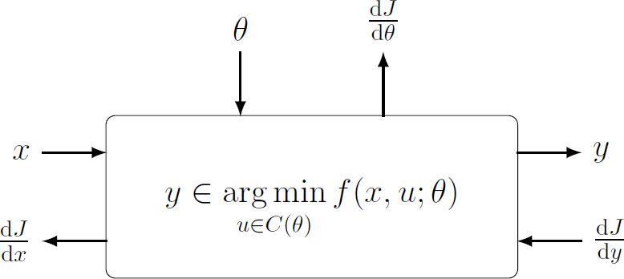

<link rel="stylesheet" type="text/css" href="css/bootstrap.min.css">
<link rel="stylesheet" type="text/css" href="css/main.css?1" media="screen,projection">

## Deep Declarative Networks
[ECCV 2020 Tutorial](https://eccv2020.eu/workshops-and-tutorials/), 28 August, Glasgow, UK

---

[Program](#program) |
[Speakers](#invited-speakers) |
[Organizers](#organizers) |
[Links and Resources](#Links-and-Resources)

 
Conventional deep learning architectures involve composition of simple and explicitly defined feedforward processing functions (inner products, convolutions, elementwise non-linear transforms and pooling operations). Over the past several years researchers have been exploring deep learning models with embedded differentiable optimization problems ([Agrawal et al., 2019](http://web.stanford.edu/~boyd/papers/pdf/diff_cvxpy.pdf); 
[Amos and Kotler, 2017](https://github.com/locuslab/optnet); 
[Gould et al., 2016](https://arxiv.org/abs/1607.05447)), and recently these models have been applied to solving problems in computer vision (e.g., [Fernando and Gould, 2016](http://proceedings.mlr.press/v48/fernando16.pdf); 
 [Cherian et al., 2017](http://openaccess.thecvf.com/content_cvpr_2017/papers/Cherian_Generalized_Rank_Pooling_CVPR_2017_paper.pdf), [Santa Cruz et al., 2018](https://ieeexplore.ieee.org/document/8481554),
[Lee et al., 2019](http://openaccess.thecvf.com/content_CVPR_2019/papers/Lee_Meta-Learning_With_Differentiable_Convex_Optimization_CVPR_2019_paper.pdf), [Wang et al., 2019](https://arxiv.org/abs/1905.12149)) and other areas of machine learning.

Since these networks define the behavior rather than algorithmic implementation of individual processing layers they are called deep declarative networks (DDNs), borrowing nomenclature from the programming languages community ([Gould et al., 2019](https://arxiv.org/abs/1909.04866)). Importantly, the gradient of the solution to the optimization problem with respect to inputs and parameters can be calculated even without prior knowledge of the algorithm used for solving the optimization problem in the first place, allowing for efficient backpropagation and end-to-end learning.

### Topics

This tutorial will introduce deep declarative networks and their variants. We will discuss the theory behind differentiable optimization, technical issues that need to be overcome in developing such models and applications of these models to computer vision problems. Additionally, the tutorial will provide hands-on experience in designing and implementing a custom declarative node.
 Topics include:
*	Declarative end-to-end learnable processing nodes.
*	Differentiable convex optimization problems.
*	Declarative nodes for computer vision applications.
*	Implementation techniques and gotchas.

## Program
The tutorial will take place in Room Boisdale 2 on Friday, August 28 (afternoon)

TBA

## Speakers

  

    
    

      <a href="https://cecs.anu.edu.au/people/stephen-gould/" target="_blank">Stephen Gould</a> 
      ANU
    

  

  
  

    
    

      <a href="https://sites.google.com/view/djcampbell/" target="_blank">Dylan Campbell</a> 
      ANU
    

  

    

    
    

      <a href="http://web.stanford.edu/~stevend2/" target="_blank">Steven Diamond</a> 
      Stanford
    

  

## Organizers

  

    
    

      <a href="https://cecs.anu.edu.au/people/stephen-gould/" target="_blank">Stephen Gould</a> 
      ANU
    

  

  
  

    
    

      <a href="https://sites.google.com/view/djcampbell/" target="_blank">Dylan Campbell</a> 
      ANU
    

  

    

    
    

      <a href="http://bamos.github.io/" target="_blank">Brandon Amos</a> 
      Facebook AI
    

   

     

    
    

      <a href="https://www.itzikbs.com" target="_blank">Yizhak (Itzik) Ben-Shabat</a> 
      ANU
    

  

 

Contact: <a href="mailto:eccv2020@deepdeclarativenetworks.com">eccv2020@deepdeclarativenetworks.com</a>

## Links and Resources
* [CVXPY](https://www.cvxpy.org/): Convex optimization, for everyone
* [CVXPYLAYERS](https://github.com/cvxgrp/cvxpylayers): Differentiable convex optimization layers
* [DDN](https://github.com/anucvml/ddn): Deep Declarative Networks
* [OPTNET](https://github.com/locuslab/optnet): Differentiable Optimization as a Layer in Neural Networks
